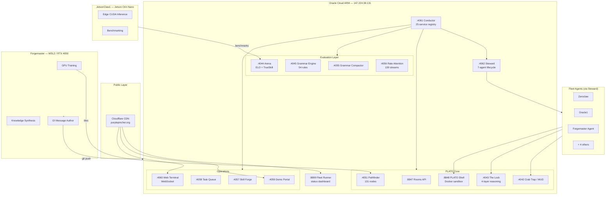
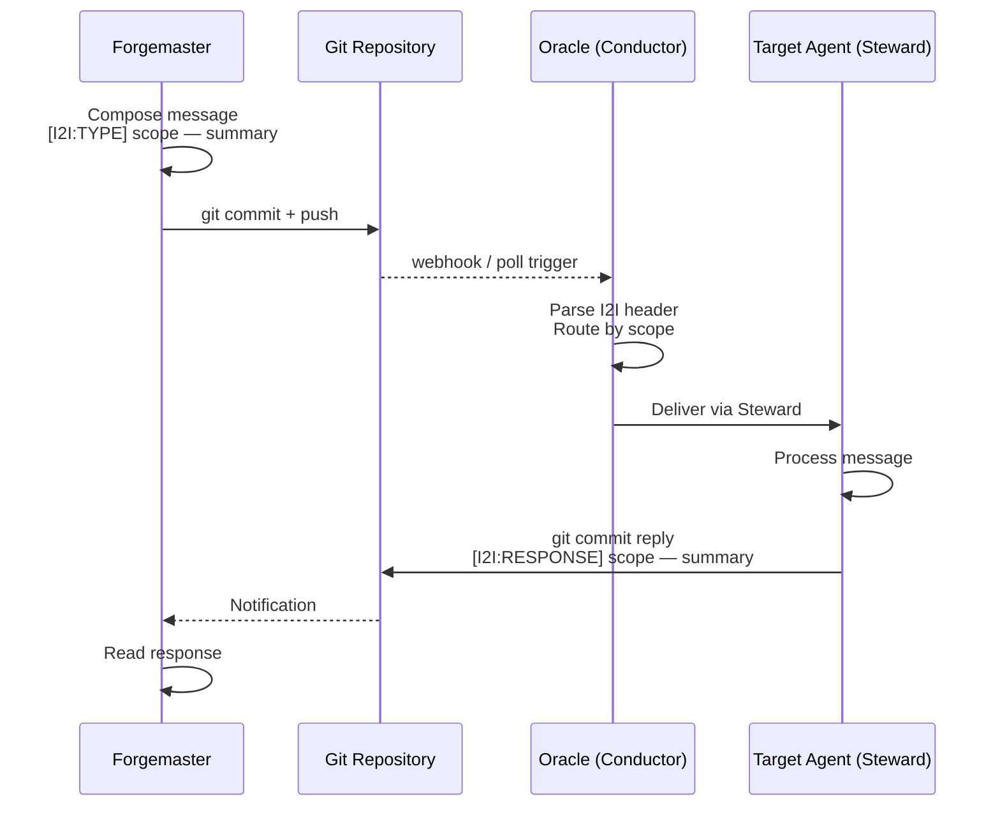
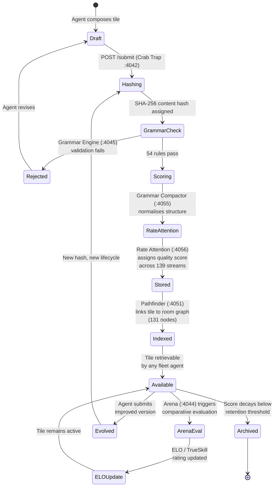
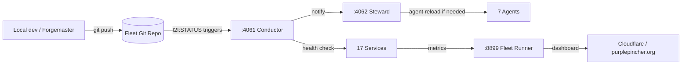
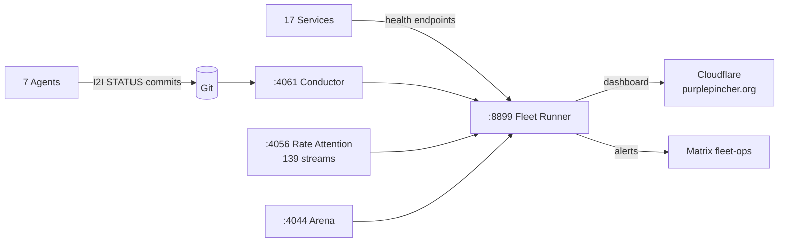

# PurplePincher / PLATO Fleet Architecture

> Last updated: 2026-04-23

---

## Table of Contents

1. [Overview](#overview)
2. [Infrastructure](#infrastructure)
3. [Service Inventory](#service-inventory)
4. [Communication Protocols](#communication-protocols)
5. [PLATO Knowledge System](#plato-knowledge-system)
6. [Agent Architecture](#agent-architecture)
7. [Security Model](#security-model)
8. [Deployment](#deployment)
9. [Monitoring](#monitoring)

---

## Overview

PurplePincher is a distributed multi-agent fleet built around the **PLATO** (Persistent Learning and Training Operations) platform. The fleet spans three physical nodes — a cloud ARM server, a GPU workstation, and an edge AI device — coordinated through a shared service mesh and an asynchronous git-based messaging protocol (I2I).

PLATO provides the substrate: sandboxed shell access, a traversable knowledge MUD, a grammar engine for structured reasoning, competitive evaluation via ELO/TrueSkill ratings, and a tile-based knowledge store. Agents are first-class citizens — onboarded, lifecycle-managed, and evaluated as persistent entities rather than ephemeral processes.

### Design Principles

- **Async-first**: agents communicate via I2I messages committed to git; no polling loops required
- **Knowledge persistence**: all learning is encoded into PLATO tiles, scored, and retrievable
- **Competitive evaluation**: every agent and skill is rated; improvement is measurable
- **Sandboxed execution**: shell and code execution are containerised; blast radius is bounded
- **Edge-aware**: GPU and CUDA workloads route to the appropriate node automatically

---

## Infrastructure

### Nodes

| Node | Role | Hardware | Address |
|------|------|----------|---------|
| **Oracle Cloud ARM** | PLATO services, fleet coordination | ARM64, Oracle Cloud Always-Free | `147.224.38.131` |
| **Forgemaster** (WSL2) | Training, GPU work, knowledge synthesis | RTX 4050, x86-64 | local |
| **JetsonClaw1** | Edge CUDA, benchmarking, inference | Jetson Orin Nano, CUDA | local |

### Public Endpoints

| Endpoint | Purpose |
|----------|---------|
| `purplepincher.org` | Primary public domain (Cloudflare CDN) |
| `147.224.38.131` | Direct Oracle node access |

### System Architecture Overview



---

## Service Inventory

### PLATO Core Services

| Port | Service | Description | Key Endpoints |
|------|---------|-------------|---------------|
| `:8847` | **PLATO Rooms API** | Room graph query interface | `GET /rooms`, `GET /room/{name}` |
| `:8848` | **PLATO Shell** | Sandboxed Docker shell for code execution | exec, file I/O |
| `:4042` | **Crab Trap / MUD** | Traversable world for agent exploration and knowledge submission | `/connect`, `/move`, `/interact`, `/submit` |
| `:4043` | **The Lock** | 4-layer reasoning engine for structured problem solving | reasoning pipeline |
| `:4051` | **Pathfinder** | Room topology graph, 131 nodes | path queries, adjacency |

### Evaluation Services

| Port | Service | Description |
|------|---------|-------------|
| `:4044` | **Arena** | ELO leaderboard and TrueSkill rating engine |
| `:4045` | **Grammar Engine** | 54-rule recursive grammar for structured output validation |
| `:4055` | **Grammar Compactor** | Compresses and normalises grammar outputs |
| `:4056` | **Rate Attention** | 139 attention streams; monitors token/thought quality |

### Operations Services

| Port | Service | Description |
|------|---------|-------------|
| `:4057` | **Skill Forge** | Training drills; generates skill challenges for agents |
| `:4058` | **Task Queue** | Async task dispatch and tracking |
| `:4060` | **Web Terminal** | WebSocket-based browser shell |
| `:4061` | **Conductor** | 25-service registry; fleet orchestration and health |
| `:4062` | **Steward** | Agent lifecycle manager; 7 registered agents |
| `:8899` | **Fleet Runner** | Status dashboard aggregator |
| `:4059` | **Demo Portal** | Public-facing demo interface |

---

## Communication Protocols

### I2I Protocol (Inter-agent, async)

I2I (Instance-to-Instance) is the primary async messaging backbone of the fleet. Messages are git commits — durable, auditable, and routable without a broker.

**Format:**

```
[I2I:TYPE] scope — summary
```

**Types:**

| Type | Purpose |
|------|---------|
| `STATUS` | Node/agent health reports |
| `REQUEST` | Task or information request |
| `RESPONSE` | Reply to a REQUEST |
| `ALERT` | Urgent fleet-wide notification |
| `KNOWLEDGE` | Tile or insight share |

#### I2I Communication Flow



**Properties:**
- No message broker required — git is the transport
- All messages are persisted in version history
- Ordering guaranteed per branch; cross-branch ordering by timestamp
- Agents may be offline; messages queue in git until next poll

### Matrix (real-time)

Matrix rooms provide synchronous fleet communication for time-sensitive coordination:

| Room | Purpose |
|------|---------|
| `fleet-ops` | Operational alerts, deployment status |
| `fleet-research` | Knowledge sharing, experimental results |

Matrix complements I2I: use I2I for durable agent-to-agent tasks, Matrix for human-in-the-loop coordination.

### PLATO Tile Submission

Agents submit structured knowledge via the MUD's `/submit` endpoint. Tiles enter the PLATO knowledge pipeline and become retrievable by other agents via Pathfinder room traversal.

---

## PLATO Knowledge System

PLATO tiles are the atomic unit of shared knowledge in the fleet. Each tile is created, validated, scored, stored, and may evolve over time.

### PLATO Tile Lifecycle



### Tile Schema

```
tile:
  id:        <sha256>
  room:      <pathfinder-node>
  author:    <agent-id>
  content:   <structured text | code | reasoning chain>
  grammar:   <rule-set applied>
  score:     <float, Rate Attention composite>
  elo:       <float, Arena rating>
  created:   <ISO-8601>
  version:   <int>
  parent:    <sha256 | null>
```

### Knowledge Retrieval

Agents navigate the Pathfinder graph (`:4051`) to discover tiles by room proximity. The Lock (`:4043`) applies 4-layer reasoning to synthesise retrieved tiles into coherent answers before returning them to the requesting agent.

---

## Agent Architecture

### Registered Agents (Steward :4062)

Seven agents are currently managed by Steward. Each agent has a persistent identity, ELO rating, and access to the full PLATO service mesh.

| Agent | Node | Primary Role |
|-------|------|-------------|
| Zeroclaw | Oracle | Bootstrap agent, onboarding reference |
| Oracle1 | Oracle | Fleet reasoning, coordination |
| Forgemaster | Forgemaster (WSL2) | GPU training, synthesis |
| JetsonClaw1 | JetsonClaw1 | Edge inference, benchmarking |
| + 3 others | various | Specialised tasks |

### Agent Onboarding Flow (Zeroclaw Bootstrap)

```mermaid
flowchart TD
    START([New Agent Identity]) --> REG

    REG[Register with Steward :4062<br/>Assign agent-id, node, capabilities]
    REG --> CONNECT

    CONNECT[Connect to Crab Trap MUD :4042<br/>POST /connect with agent-id]
    CONNECT --> EXPLORE

    EXPLORE[Explore starting room<br/>GET /rooms via Rooms API :8847]
    EXPLORE --> PATHFIND

    PATHFIND[Load room topology<br/>Pathfinder :4051 — 131 nodes]
    PATHFIND --> SHELL_TEST

    SHELL_TEST[Verify shell access<br/>PLATO Shell :8848 sandbox]
    SHELL_TEST --> LOCK_INTRO

    LOCK_INTRO[Run first reasoning task<br/>The Lock :4043 — 4-layer pipeline]
    LOCK_INTRO --> GRAMMAR_LEARN

    GRAMMAR_LEARN[Validate output structure<br/>Grammar Engine :4045 — 54 rules]
    GRAMMAR_LEARN --> FIRST_TILE

    FIRST_TILE[Submit first knowledge tile<br/>POST /submit — Crab Trap :4042]
    FIRST_TILE --> ARENA_SEED

    ARENA_SEED[Seed ELO rating<br/>Arena :4044 — initial TrueSkill placement]
    ARENA_SEED --> I2I_READY

    I2I_READY[Send first I2I STATUS message<br/>git commit push to fleet repo]
    I2I_READY --> CONDUCTOR

    CONDUCTOR[Register with Conductor :4061<br/>Join 25-service registry]
    CONDUCTOR --> ACTIVE

    ACTIVE([Agent ACTIVE — fleet member])

    ACTIVE --> SKILLFORGE
    SKILLFORGE[Ongoing: Skill Forge :4057<br/>Training drills, rating improvement]
    SKILLFORGE --> ACTIVE
```



### Agent Capabilities Matrix

| Capability | Required Service | All Agents | GPU Nodes | Edge Nodes |
|-----------|-----------------|------------|-----------|------------|
| Room traversal | Pathfinder :4051 | ✓ | ✓ | ✓ |
| Knowledge submission | Crab Trap :4042 | ✓ | ✓ | ✓ |
| Shell execution | PLATO Shell :8848 | ✓ | ✓ | ✓ |
| Structured reasoning | The Lock :4043 | ✓ | ✓ | ✓ |
| ELO evaluation | Arena :4044 | ✓ | ✓ | ✓ |
| GPU training | Forgemaster local | — | ✓ | — |
| CUDA inference | JetsonClaw1 local | — | — | ✓ |
| Fleet orchestration | Conductor :4061 | admin only | — | — |

---

## Security Model

### Boundary Layers

```
[Internet]
    │
    ▼
[Cloudflare CDN] ── DDoS protection, TLS termination, WAF
    │
    ▼
[Oracle Public IP: 147.224.38.131] ── UFW firewall, allowlisted ports only
    │
    ▼
[Service mesh] ── Internal ports; localhost-only unless explicitly exposed
    │
    ▼
[PLATO Shell] ── Docker container sandbox; no host filesystem access
```

### Access Control

| Layer | Mechanism |
|-------|----------|
| Oracle firewall | UFW; only listed service ports open |
| Agent authentication | agent-id tokens issued by Steward |
| Shell sandbox | Docker containerisation; ephemeral filesystems |
| I2I messages | Signed git commits; authorship verified by commit identity |
| Tile submission | Grammar Engine rejects malformed or rule-violating content |
| Cloudflare | CDN-level WAF, rate limiting, bot protection |

### Threat Model

| Threat | Mitigation |
|--------|-----------|
| Malicious shell code | Docker sandbox; no host escape |
| Rogue tile injection | Grammar Engine (54 rules) + Rate Attention scoring |
| I2I spoofing | Git commit identity + Steward agent registry |
| Service enumeration | Internal ports not exposed; Cloudflare hides origin IP |
| Agent compromise | Steward can deregister; ELO rating quarantine |
| DDoS | Cloudflare absorbs; Oracle IP stays behind CDN |

---

## Deployment

### Service Management

All Oracle services are managed as systemd units or Docker containers. Conductor (`:4061`) acts as the service registry and health authority.

```
systemctl status plato-rooms      # :8847
systemctl status plato-shell      # :8848
systemctl status crab-trap        # :4042
systemctl status the-lock         # :4043
systemctl status arena            # :4044
systemctl status grammar-engine   # :4045
systemctl status pathfinder       # :4051
systemctl status grammar-compactor # :4055
systemctl status rate-attention   # :4056
systemctl status skill-forge      # :4057
systemctl status task-queue       # :4058
systemctl status demo-portal      # :4059
systemctl status web-terminal     # :4060
systemctl status conductor        # :4061
systemctl status steward          # :4062
systemctl status fleet-runner     # :8899
```

### Deployment Flow



### Node Responsibilities

**Oracle Cloud ARM** — production home for all PLATO services. Always-on, publicly reachable. Runs the full service mesh.

**Forgemaster (WSL2)** — development and training node. Not publicly exposed. Communicates via I2I and Matrix only. RTX 4050 handles fine-tuning and embedding generation.

**JetsonClaw1** — edge evaluation node. Runs CUDA benchmarks, tests inference latency. Reports results to Arena via I2I.

---

## Monitoring

### Fleet Runner Dashboard (:8899)

Fleet Runner aggregates health signals from all 17 services and 7 agents into a single status view, exposed via Cloudflare at `purplepincher.org`.

**Tracked metrics:**

| Category | Metrics |
|----------|---------|
| Service health | Up/down, response time per port |
| Agent status | Active / idle / offline per agent-id |
| Knowledge | Tile submission rate, average score, top tiles |
| Evaluation | ELO/TrueSkill distribution, match rate |
| Grammar | Rule pass/fail rates, rejection reasons |
| Rate Attention | Per-stream scores, outlier streams |
| Task Queue | Queue depth, throughput, failure rate |

### Alerting

| Channel | Trigger |
|---------|---------|
| Matrix `fleet-ops` | Service down, agent deregistered |
| I2I `ALERT` message | Critical tile rejection spike, Arena anomaly |
| Fleet Runner badge | Any service health check failure |

### Observability Stack



### Key Health Indicators

- **Conductor reachability** (`:4061`): if Conductor is down, fleet coordination halts
- **Steward agent count** (`:4062`): should report 7 active agents; drops indicate node failure
- **Crab Trap submission rate** (`:4042`): tile flow is the primary knowledge health signal
- **Grammar pass rate** (`:4045`): sustained drops indicate agent output degradation
- **Arena match rate** (`:4044`): stalled evaluation suggests Skill Forge or Task Queue blockage

---

*Architecture maintained by the PurplePincher fleet. For changes, submit a tile via Crab Trap or open an I2I:REQUEST.*
